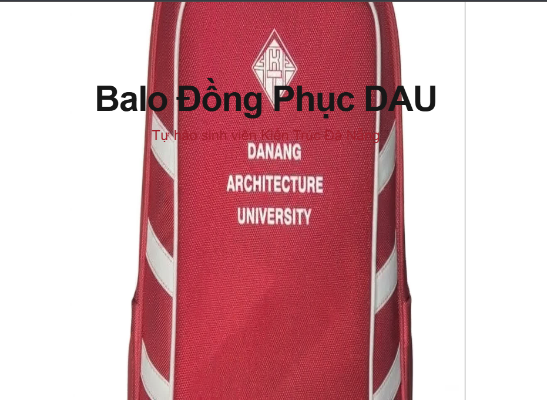

# 🎒 Balo Đồng Phục DAU - 3D Scroll Experience

Trải nghiệm landing page cao cấp dành cho sản phẩm Balo đồng phục của **Đại học Kiến trúc Đà Nẵng (DAU)**. Trang web kết hợp kỹ thuật diễn hoạt chuỗi hình ảnh (image sequence) mượt mà dựa trên hành vi cuộn chuột của người dùng, tạo hiệu ứng xoay 3D chân thực.

## 🚀 Live Demo
Xem bản demo trực tiếp tại đây: **[balo-dau-3d.vercel.app](https://balo-dau-3d.vercel.app/)**

## 🖼️ Demo Image


## ✨ Tính năng nổi bật
- **3D Scroll Animation**: Xoay balo 360 độ khi cuộn trang bằng HTML5 Canvas.
- **Storytelling Overlays**: Các thông điệp về thiết kế và tính năng xuất hiện linh hoạt theo tiến trình cuộn.
- **High Performance**: Tối ưu hóa việc tải trước (preload) 176 khung ảnh để đảm bảo trải nghiệm không bị giật lag.
- **Premium Design**: Giao diện tối giản, sang trọng với tông màu chủ đạo trắng và đỏ DAU (#A31D2A).

## 🛠️ Công cụ phát triển
Dự án này được xây dựng và tối ưu hóa bởi sự kết hợp của bộ công cụ mạnh mẽ từ **Google**:
- **Antigravity**: Hệ thống AI hỗ trợ lập trình thông minh.
- **Whisk**: Công cụ tăng tốc quy trình phát triển.
- **Flow**: Bộ công cụ giúp quản lý và triển khai luồng công việc mượt mà.

## 💻 Cài đặt và Chạy thử
1. Clone dự án:
   ```bash
   git clone https://github.com/nguyenvanduydev001/balo_dau_3d.git
   ```
2. Cài đặt dependency:
   ```bash
   npm install
   ```
3. Chạy môi trường phát triển:
   ```bash
   npm run dev
   ```

---
*Dự án lấy cảm hứng từ niềm tự hào sinh viên Kiến trúc Đà Nẵng.*
